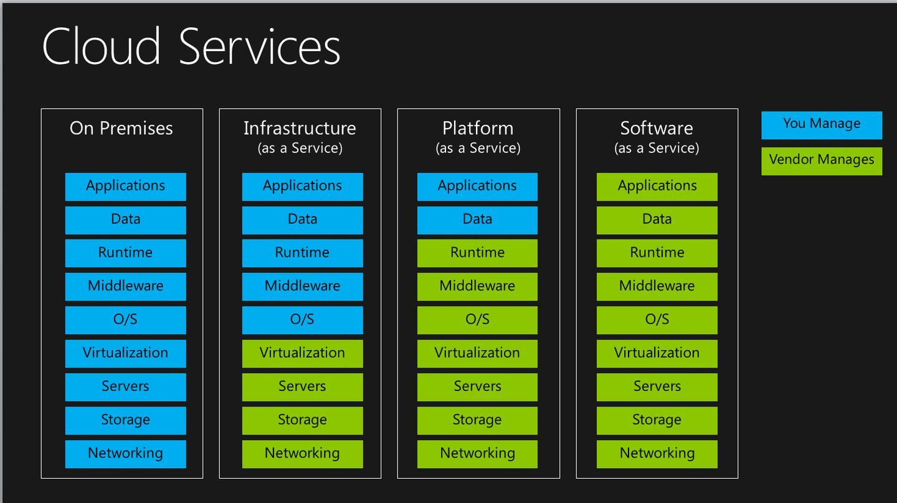
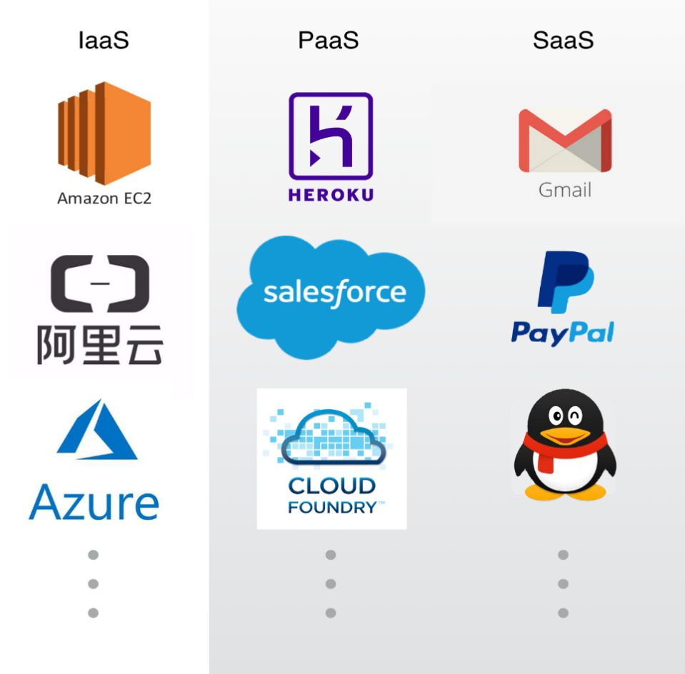

- utf8mb4: most bytes 4即是使用4个字节来表示utf8
- buffer和cache区别?
  - buffer:`A buffer is something that has yet to be "written" to disk.` 这些数据准备写到磁盘的，但还没有写到磁盘，缓存在内存中
  - cache: `A cache is something that has been "read" from the disk and stored for later use.` 从磁盘上读取数据存储到内存中缓存起来，方便下一次使用。目的是避免频繁的去磁盘上读取数据，直接从内存中读取使用了。
  
- 什么是RESTful?       
  REST(Resource Representational State Transfer,表现层状态转移).精辟的理解就是**URL是定位资源，用HTTP动词（GET,POST,DELETE,DETC）描述操作。**所以uri最好是名词,常用的HTTP动词:
    GET     获取一个资源 
    POST    添加一个资源 
    PUT     修改一个资源 
    DELETE  删除一个资源
    
- 什么是堆和栈?
[参考](https://zhuanlan.zhihu.com/p/72007079)    

- IaaS、PaaS和SaaS是什么?
有个例子不错,假设你要建个网站,最原始的就是你要自己买服务器,安装服务器软件,编写网站程序
IaaS(Infrastructure as a Service):基础即服务.不用买服务端,在哪家买下虚拟机即可,但还是需要自己安装服务器软件.
PaaS(Platform as a Service):平台即服务.只需编写网站程序.
SaaS(Soft as a Service):软件即服务.连网站程序都不用你写了,比如你买了个论坛或在线网店,你只要运营.
各个服务详细提供了什么服务可以见总结不错的图 

[参考](https://www.zhihu.com/question/20387284/answer/28514161, https://www.zhihu.com/question/20387284/answer/743669668)
 