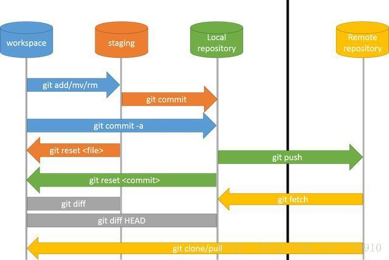

#git 工作流程：

[教程参考](https://backlog.com/git-tutorial/cn/)

##git裸仓:
>就是没有工作目录的仓库; 即是没有实际源文件,只是包含版本历史记录的仓库.
git init --bare myproject mybare.git    //获取myproject项目的版本历史记录即不包含实际源码生成一个mybare.git裸仓.(该命令
的整体效果如执行 cp -Rf my_project/.git my_project.git ,即是复制一份myproject项目下的.git文件.

#git clone --bare myproject mybare.git    
>获取myproject项目的版本历史记录即不包含实际源码生成一个mybare.git裸仓.(该命令
的整体效果如执行`-Rf my_project/.git my_project.git,即是复制一份myproject项目下的.git文件.

##对项目快速添加git版本管理: 在项目根目录中输入 git init, 在此命令之前最好有.gitignore, 这样初始化时就能把要忽略的文件忽略

##git rm --cached [-r] 文件名 
删除已经追踪的文件,然后在进行 git commit,git push 操作后就可以将文件忽略

##将本地密钥推送到服务器上：
    ssh-copy-id -i ~/.ssh/id_rsa.pub git@111.22.180.99

##添加远端地址并推送：
    git remote add origin https://github.com/miracle2017/test.git
    git push -u origin master（由于第一仓库是空的，所以要加- u，之后就不用）

##删除远端origin关联：
git remote rm origin

##自动化部署
在裸仓目录下/hooks/post-receive 文件写入如下代码
#!/bin/bash
git --work-tree=/home/wwwroot/your_project_path checkout -f

#git撤销
- 只是提交了commit, 但是还未push.
  git reset --soft HEAD^ : 
      --soft只会撤销commit, 更改的内容不会撤销. 
      --hard会撤销commit,并丢弃修改的内容
      HEAD^的意思是上一个版本，也可以写成HEAD~1,如果进行了2次commit，想都撤回，可以使用HEAD~2.
  
