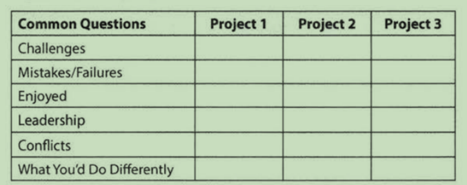

# the interview  process
# behind the scenes
什么决定你是否被录用? 
是否被录用,其实更多的不是看你们分数, 而实际上是你与其他候选人的对比.你能否比其他候选表现得更好.

书中建议点: 
- 你要表现出对公司很兴趣.要对公司有所了解.

# V  Behavioral Questions
- 确保你能详细讲解简历中的每个方面(如项目,工作,活动),以下表格的问题应该会有助于你思考你的项目.

- given structure answer
  先简明概要整个故事, 然后S.A.R(situation, action, result)

# IV before interview
- 获得正确的经验
  - 和领导表示你想做更多更有挑战的工作,越多越好.使用相关的技术让这些成为简历中的亮点.
  - **使用你的晚上和周末的空闲时间.搭建a mobile app, a web app, or a piece of desktop software.这也是一种很好的获得
  新技术经验的办法, 这让你更贴近当今的公司. 很少有什么事情比搭建一个应用只是为了好玩更让面试官印象深刻了.**
## 写一份好的简历
- 简历筛选者和面试官一样,他们都想要知道:**你是聪明的和能写代码.** 这意味着,你应该在你的简历中强调这两点.你的非技术爱好等并不能太多证明这两点.所以多写
些技术的,爱好这些简短就好.
- 适当的长度. 通常1页即可(如果你超过10年可以适当加长到1.5-2页).如果你认为你有太多的经验无法在1-2页装下.相信我是可以的.**长的简历并不反映有许多经验,
它反应了你没有理解如何对内容进行优先排序.**
- 工作历史
  >不用写出你以往所有的角色,只要写与应聘相关角色--即是能使你成为突出的候选者的角色
  - writing strong bullet.
    >对于每个角色,尽力用如下格式来讨论你的成就:Accomplished X By implementing Y which let to X.如下例子:
    - Reduced object rendering time by 75% by implementing distributed caching, leading to a 10% reduction in log-in time:
    - Increased average match accuracy from 1.2 to 1.5 by implementing a new comparison algorithm based on windiff
    >你所做的事情可能不会都适合用这个表达方法,但是基本原则是一样的: 你做了什么? 怎么做的? 结果是什么? 理想的,要让结果可测量.
- 项目
列举2-4个你最重要的项目. 描述项目是什么,使用了什么语言或技术.(你可能还想描述下是团队项目,还是个人项目,或者课程,但这些细节其实不需要,只要这个项目让你
看起来更印象深刻,你就可以写.)
- 程序语言和软件
  - 软件: 你使用的软件其实不是很有必要,这会占据些词汇,你可以自行权衡下
- 程序语言
列出语言,并带上熟练程度. 比如php(精通), vue(以往使用过)
