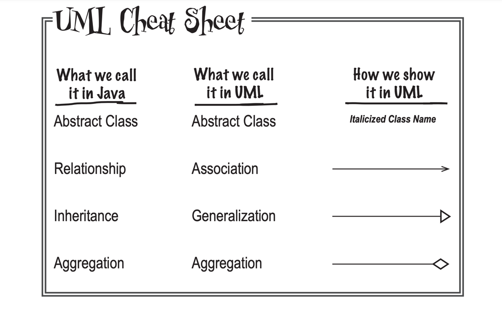

# chapter 4: analysis

1. 写好用例(use case)
2. 圈出用例中的名词. 
   2.1 一般地,这些名词就你系统所需的类(class)的候选(当然有些名词是不需要建个类的:比如系统外的事物,系统又不需要与之交互; 不需要系统表示的)
   2.2 一般地,用例中的动词就是这些类的方法.
3. 

重点: p179(why didnn't Maria create a dog class?)

# chapter 5: good design = flexible software
Whenever you find common behavior in two or more places, look to abstract that behavior into a class, and 
then reuse that behavior in the common classes.

- p207: 

- p224: 什么是接口?
面向接口编程而不是面向实现编程,这会让你的程序更容易扩展.因为面向接口,是与接口的所有子类(甚至是还没有创建的子类)交互,而面向实现,那么就只能
与一个特定的实现交互.

- p226: 什么是封装?
封装不仅仅是将多个重复代码封装为一个;同时封装帮你保护类不受不需要的改变. 当你想系统有可能需要更改的行为,你应该将该部分从其他的不怎么会改变的代码中
移出来, 换句话说,你总是在尝试封装变化的内容.

- p265: 什么是改变?
软件中唯一不变就是改变.让软件有弹性最简单的方式保证**每个类只有一个理由能去更改.**

- OO原则(非常重要的原则)
  - 封装变化的内容
  - 面向接口而非实现编程
  - 系统中的每个类应该只能有一个理由可以更改它(Each class in your application should have only one reason to change.)