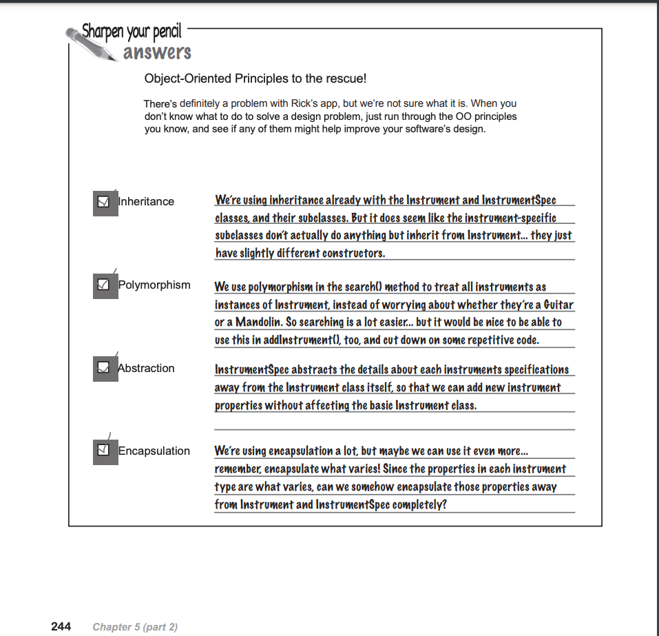

# chapter 4: analysis

1. 写好用例(use case)
2. 圈出用例中的名词. 
   2.1 一般地,这些名词就你系统所需的类(class)的候选(当然有些名词是不需要建个类的:比如系统外的事物,系统又不需要与之交互; 不需要系统表示的)
   2.2 一般地,用例中的动词就是这些类的方法.
3. 

重点: p179(why didn't Maria create a dog class?)

# chapter 5: good design = flexible software
Whenever you find common behavior in two or more places, look to abstract that behavior into a class, and 
then reuse that behavior in the common classes.

- p207: 

- p224: 什么是接口?
面向接口编程而不是面向实现编程,这会让你的程序更容易扩展.因为面向接口,是与接口的所有子类(甚至是还没有创建的子类)交互,而面向实现,那么就只能
与一个特定的实现交互.

- p226: 什么是封装?
封装不仅仅是将多个重复代码封装为一个;同时封装帮你保护类不受不需要的改变. 当你想系统有可能需要更改的行为,你应该将该部分从其他的不怎么会改变的代码中
移出来, 换句话说,你总是在尝试封装变化的内容.

- p265: 什么是改变?
软件中唯一不变就是改变.让软件有弹性最简单的方式保证**每个类只有一个理由能去更改.**

- OO原则(非常重要的原则)
  - 封装变化的内容
  - 面向接口而非实现编程
  - 系统中的每个类应该只能有一个理由可以更改它(Each class in your application should have only one reason to change.)

- 当你不知道怎么解决一个设计(design)问题时,只要浏览一遍你所学的OO原则,逐条原则看下是否有可以提升你代码的? 

- 在任何OO设计中一个关键原则即是将变化内容封装起来.

- when you have a set of properties that vary across your objects, use a collection, like a Map, to store those properties
dynamically.
you will remove losts of methods from your classes, and avoid having to change your code when new properties are added to your app.
(学习到的但你有一系列属性随着对象不同而不同,那么考虑用一个map存储这些变化的属性,将变化封装出来.使用map是知识点不错的方法)

- 什么是cohesive? 一个有内聚的类在一件事上做得很好，而不是试图做或成为其他事情. 
  - 检查你类中每个方法,这些方法做的事是否都与你类的名称相关,若有个方法看着格格不入,那么它可能属于其他地方
  - 若一个类做了一系列的事相关性不是很强, 你的内聚可能很低.

- dumb question
  - 所以高内聚的软件是低耦合的,对吗?
    是的, **软件内聚性越高,类之间耦合性越低**. 内聚高的类,只有一个理由去改动它,所以类的内部改动,对于系统其他部分影响不是很大.

  - 高内聚低耦合是否就意味着系统易于改变?
    当你对系统做了很底层很根本性的改动时,虽然系统已是高内聚低耦合,但可能也需要做许多改动.所以高内聚不总是检验软件是否易于改变,但当不需要对系统的
  工作方式做很剧烈的变动时,高内聚的软件通常是易于改变的.

  - 高内聚比低耦合好是吗?
    是的.好的OO设计是你系统中每个类,模块只做一件基础的事.只要一个类开始做两个或者三个不同的事.你可能在远离高内聚和好的OO设计.
  
  - 高内聚的软件是否更易于复用,还有改变?
    你的系统内聚性越高,每个对象做的任务定义得越好; 一个对象定义得越好(对象做的事), 这个对象越容易从他的上下文中抽取出来, 然后能将这个对象放在其他上下文
    中去做同样的事. **对象非常乐于只做它很专职的事,而不管被应用于哪里**

# chapter 6: solving big problems
- 从顾客中获取需要的功能(features), 然后理解为了实现这些功能的需求(requirements). (feature和requirement的关系)