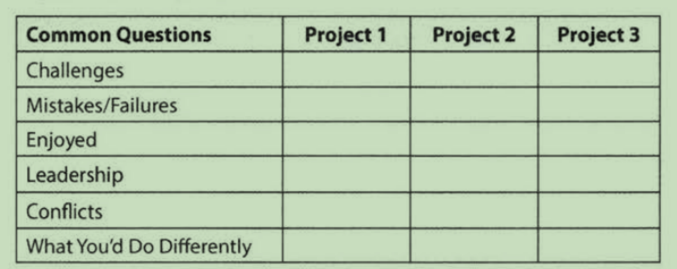

# I. the interview  process
- 手写代码让你更专注于重要的部分(whiteboard)
很多人会说现实开发中根本不在纸上写代码,为什么面试要手写代码. 手写代码让你专注于全局,哪部分是重要逻辑.不过不是伪代码,当然错误越少越好.有的面试者
被给电脑写代码时交流明显就减少了.

# II. behind the scenes
什么决定你是否被录用? 
是否被录用,其实更多的不是看你们分数, 而实际上是你与其他候选人的对比.你能否比其他候选表现得更好.

书中建议点: 
- 你要表现出对公司很兴趣.要对公司有所了解.

# V. Behavioral Questions
- 确保你能详细讲解简历中的每个方面(如项目,工作,活动),以下表格的问题应该会有助于你思考你的项目.

- 你的弱点是什么?

  不能自大或不承认自己的错误. 好的回答应该是传达你的真实,合理的弱点但要强调你是怎么克服他的?

- 你应该问面试官的问题?
  - 真实问题: 你实际想要知道问题的答案.以下例子对多数应聘者都有价值
    - 测试,开发,项目经理的比例.他们间的互动是怎么样?项目计划是怎么在团队中进行的?
    - 是什么让你来到了这个公司? 对于你来说什么是最大的挑战?
  - Insightful Questions:这些问题展示了你的知识和技术的理解.提问这些问题通常需要提前了解公司.
    - 我注意到你们使用技术X, 你们是怎么解决问题Y的?
    - 为什么应用选择了X协议而不是Y协议? 我知道他有A,B,C的好处,但是许多公司不使用他因为问题D.
  - Passion Questions:这些问题证明了你对技术的热情,表明你对学习很感兴趣,对公司会是个强有力的贡献者.
    - 我对可扩展性非常感兴趣,想要了解更多这方面的知识.公司中有什么机会可以学习这方面的知识.
    - 我不熟悉技术X,但听起来是一个非常有趣的解决方案.你告诉我更多关于他是怎么工作的?
    
- 了解你的技术项目
   作为准备的一部分,你需要专注于2-3个你深入掌握的技术项目.理想情况下你选择的项目应符合下列条件:
  - 项目有挑战部分(超越仅是学到了很多)
  - 你扮演主要角色
  - 你可以技术深入讨论
   你所有的项目都要能说出挑战,错误,技术决定,技术选择(他们之间的权衡). 你同样可以思考后续的问题,比如怎么扩展应用.

- **谈谈你自己(So, tell me about yourself)**
  许多面试官会这样开启会话:介绍下你自己或者让你介绍下简历.这是实际就是一个"推销"自己的机会,这个你面试官对于的第一印象,所以你要搞定他.
  结构: 一个典型的对于大多数人都合适的结构是按照时间顺序来,开头先简单描述下当前工作,最后结束时讨论下自己相关和感兴趣的工作外的爱好(如果有的话)
  例子(具体看下原文):
  - 1.当前的工作角色(简单).
  - 2.大学
  - 3.大学后
  - 4.现在工作角色(具体)
  - 5.工作外
  - 6.总结
  
- given structure answer
  先简明概要整个故事, 然后S.A.R(situation, action, result)

- 爱好
爱好想好要不要说,如果是比较常见普通的爱好就可以不用说了,因为经常会是一些没用的东西.但如果你的爱好符合以下:
  - 你的爱好非常唯一.这可能会引起一段对话,然后以亲切的方式面试.
  - 爱好是技术的.
  - 你的爱好表现出你的积极人格特质.

# IV. before interview
- 获得正确的经验
  - 和领导表示你想做更多更有挑战的工作,越多越好.使用相关的技术让这些成为简历中的亮点.
  - **使用你的晚上和周末的空闲时间.搭建a mobile app, a web app, or a piece of desktop software.这也是一种很好的获得
  新技术经验的办法, 这让你更贴近当今的公司. 很少有什么事情比搭建一个应用只是为了好玩更让面试官印象深刻了.**
## 写一份好的简历
- 简历筛选者和面试官一样,他们都想要知道:**你是聪明的和能写代码.** 这意味着,你应该在你的简历中强调这两点.你的非技术爱好等并不能太多证明这两点.所以多写
些技术的,爱好这些简短就好.
- 适当的长度. 通常1页即可(如果你超过10年可以适当加长到1.5-2页).如果你认为你有太多的经验无法在1-2页装下.相信我是可以的.**长的简历并不反映有许多经验,
它反应了你没有理解如何对内容进行优先排序.**
- 工作历史
  >不用写出你以往所有的角色,只要写与应聘相关角色--即是能使你成为突出的候选者的角色
  - writing strong bullet.
    >对于每个角色,尽力用如下格式来讨论你的成就:Accomplished X By implementing Y which let to X.如下例子:
    - Reduced object rendering time by 75% by implementing distributed caching, leading to a 10% reduction in log-in time:
    - Increased average match accuracy from 1.2 to 1.5 by implementing a new comparison algorithm based on windiff
    >你所做的事情可能不会都适合用这个表达方法,但是基本原则是一样的: 你做了什么? 怎么做的? 结果是什么? 理想的,要让结果可测量.
- 项目
列举2-4个你最重要的项目. 描述项目是什么,使用了什么语言或技术.(你可能还想描述下是团队项目,还是个人项目,或者课程,但这些细节其实不需要,只要这个项目让你
看起来更印象深刻,你就可以写.)
- 程序语言和软件
  - 软件: 你使用的软件其实不是很有必要,这会占据些词汇,你可以自行权衡下
- 程序语言
列出语言,并带上熟练程度. 比如php(精通), vue(以往使用过)

# VIII. The Offer and Beyond
## 谈判
几乎没人喜欢谈判,但它是非常非常值得.
- just do it.你的招聘者通常不会因为你的谈判而撤销offer,所以你损失很小.特别是大公司,你谈判的对象通常不是你未来的同事.
- 具体.说出你具体想要的,不要说多点,这样他们会就是多一点点以便满足你的愿望
- 多要点.通常他们不会满足你全部,会有一个折中,所以当你多要点才能要到你实际想要的数字.
- 此外,大公司对雇员有个等级,同个等级是差不多的,如果你要更多,你需要向你的招聘者和未来团队证明你的经验值得更高的等级-这是困难的事情但是可行的

## **on the job**(重要,有触动到)
你的职业生涯并止于面试.事实上才刚开始.**一旦你加入公司,你就需要开始思考你的职业生涯道路.你将要从这里去到哪里?怎么到达哪里?**
- __制定一个时间表(set a timeline)__
  这是一个常见的故事:你加入一个公司,你非常兴奋.一切都非常好.5年后,你仍然还在那里.然后你意识到后面3年,对你的技能树或简历并没有太多增加.
  所以你为什么不在2年后离开? 当你享受你的工作时,你很容易陷入进去并没有意识到你的事业并没有前进.所以这就是为什么你需要开始一个新工作前就勾勒好
  你的职业道路.10年后你要到达什么位置?到达那里需要什么必要步骤.每年想下下一年经验会给你带来什么?上一年你的职业和技能有何进步?
  通过勾勒你的职业道路,并定期检查,你可以避免陷入自我满足的陷阱中.
- __建立良好人际关系__
  当你要找新的时候.你的人脉至关重要,在线申请是很棘手的,个人推荐会好很多,所以这就依赖于你的人脉.当同事离开后,和他们保持联系.当他们离开几周后,和
  他们联系下很帮助建立从工作到个人的关系.这同样适合你的个人生活. Your friends, and your friends of friends, are valuable
  connections. Be open to helping others, and they'll be more likely to help you.
- __要求你想要的__
  你是你最好的推销者,这样你才能完成你时间表上的目标.你需要合理的跟你上级坦白你的目标.如果你想做更多的后端工作,和你上级说;你想要探索更多的领导机会,
  讨论下你怎样才能这样做.
- __保持面试__
  设定一个目标每年至少面试一次,即使你不找工作.这样会保持你的面试技能新鲜.同时使你跟上步伐不脱节,了解外面有什么样的机会(和薪水)

# IX. Interview Questions
## Concepts and Algorithms
### Chapter 11. Testing
对于一个软件工程师来说,测试是一件重要的事情.
#### 测试一款软件
软件测试有2个核心概念:
- 手动测试和自动化测试:
- 黑盒测试和白盒测试: **他们主要区别是对软件的不同程度访问.**黑盒测试时我们给定的是软件原样然后测试他;白盒测试时我们能额外访问程序去测试单独functions.

#### Troubleshooting Questions(故障排除的问题)
>调试或排除现有问题.许多候选人都对这样问题犹豫不决给出不切实际的答案比如:"重装软件",这可能会解决用户问题,但无法帮到其他也会遇到同样问题的用户.
你的目标是明白到底发生了什么?这样开发才能修复他. 比如有个问题:用户说他开发Chrome崩溃.

- 1.明白场景: 第一步你应该多问问题尽可能多的了解情况
  - 用户遇到这个问题多久了
  - chrome版本? 系统版本?
  - 问题是持续出现?还是偶尔出现?什么时候出现?
  - 是否有错误报告?
- 2.分解问题: 现在你了解情况了,你要将问题分解为可测试单位. 在本例子中你可以想象场景的流程如下:(一个强大的测试会遍历如下场景以诊断问题)
  - 点击浏览器图标
  - 浏览器实例启动
  - 浏览器加载配置
  - 浏览器发送首页的http请求
  - 浏览器获取http response
  - 浏览器解析网页
  - 浏览器展示内容
- 3.创建具体,可管理测试: 上面每个指令都应该有实际的指令.你可以自己做(自己复现)或者让用户做.在现实中,你会和用户打交道,你不能给他们不能做或不愿做的指令.